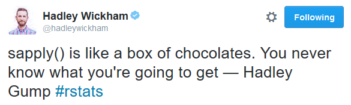

## R Object Classes, Functions and Coding Patterns

**Mike Badescu, PhD**

@[MikeBadescu](https://twitter.com/MikeBadescu)

HTML Slides on GitHub Pages: <https://mikebadescu.github.io/dallas-roo/>

Source Code on GitHub: <https://github.com/MikeBadescu/dallas-roo>

Dallas R Users Group  
September 17, 2016


## About

**[Mike Badescu](http://mihaibadescu.net/)**

- PhD Economics, Lehigh University
- Experience: Economics, Finance, Statistics, Valuation
- Programming / main tools: R, Python, SQL, Spark, Scala

**[Numeract](http://numeract.com/)**

- Data Science and Economics / Finance consulting services


## Summary 

1. R Object Classes
    * S3
    * S4
    * Reference Classes & R6
2. R Functions and Coding Patterns
    * dplyr & ggplot2
    * immutability vs mutability
    * pure functions
3. Open mic: how do you use R?


## Object-Oriented Programming (OOP)

Main Principles:

- Abstraction
    + identify essential characteristics that distinguish objects
- Encapsulation 
    + hide implementation
- Modularity / Inheritance 
    + promote code reuse (Don't Repeat Yourself - DRY)
- Polymorphism
    + single interface to entities of different data types

## Motivation {.build}

Setup
```{r setup, message=FALSE, warning=FALSE}
library(tibble); library(dplyr) 
library(ggplot2); library(R6)
```

Regular polygons, first take
```{r}
triangle_size <- 6
square_size   <- 4
hexagon_size  <- 5
```

A common distinguishing feature: `size`
```{r}
triangle <- list(size = 6)
square   <- list(size = 4)
hexagon  <- list(size = 5)
```

## Motivation {.build}

Size alone is not sufficient:

```{r}
x <- list(size = 6)

# is x a square or a triangle?
```

Adding `sides`

```{r}
triangle <- list(sides = 3, size = 6)
square   <- list(sides = 4, size = 4)
hexagon  <- list(sides = 6, size = 5)
```

## Motivation

The objects `triangle`, `square` and `hexagon`:

- have the same **object attributes**  
- belong to the same type of object / **class**: `regular_polygon`

We can perform similar actions: `print()`, `resize()`, `plot()`  

- functions associated with objects are called **methods**

## Motivation {.build}

Let's implement a print function:

```{r}
print_rp <- function(rp) {    # hmm... the 'print' name is taken
    cat("Regular polygon with", rp$sides, 
        "sides of size", rp$size, "\n")
}

print_rp(triangle)
```

**Nice!**

A readable representation of the object is always welcome!

## Motivation {.build}

Let's implement `resize()`:
```{r}
resize <- function(rp, value = 1) {
    rp$size <- rp$size * value
    rp
}

print_rp(resize(triangle, 2))
print_rp(triangle)  # the original object is unchanged
```

## Motivation

Or we can also use a **replacement function**:
```{r}
`size<-` <- function(rp, value = 1) {   # note the name
    rp$size <- rp$size * value
    rp
}

triangle_copy <- triangle  # let's work with a copy
size(triangle_copy) <- 2 
print_rp(triangle_copy)
```

We modified the original / input object.

## Motivation {.build}

**Congratulations, we have a rudimentary OO model!**

*Anything missing?*

**How do I add a circle to the collection?**

- Circles are distant relatives of Regular Polygons
    + common elements like `size`
    + different elements such as `sides` and `print_rp()`
- This is **Inheritance**

**I would love to use `print()` instead of `print_rp()`!**

- This is **Polymorphism**

## S3

- S3 is an OO style based on **generic functions**
- In Java, Python:
    + `triangle.resize()`
    + the object decides which method to call
- In R:
    + `resize(triangle)`
    + a **generic function** used as dispatcher
- Main role: specific methods for print, summary, plot, predict, etc.


## S3 Classes

The class belongs to the object as an R attribute

```{r}
attr(triangle, "class") <- "regular_polygon"
triangle
```

## S3 Classes {.build}

Better: use `class()`

```{r}
class(square) <- "regular_polygon"
class(square)
class(hexagon) <- "regular_polygon"
class(hexagon)
```

## S3 Example

We have seen classes before

```{r}
df1 <- data.frame(a = 1:2, b = 3:4)
class(df1)
str(df1)
```

## S3 Example

Under the hood, statistical models are lists

```{r}
model <- lm(b ~ a, data = df1)
class(model)
str(model)
```

## S3 Example

More than one class is possible

```{r}
df2 <- as_data_frame(df1)
class(df2)
str(df2)
```

## S3 Example

Printing using the same function `print()`

```{r}
print(df1)
print(df2)
```

## S3 Example

We can `print()` the model, even if it is a different object
```{r}
print(model)
```

**How does this magic work?**

## S3 Generic Functions {.build}

Let's look at the code for `print()`
```{r}
print
```

`UseMethod()` is the dispatcher!

From `?UseMethod`:

> Method dispatch takes place based on the class(es) of the **first argument**
to the generic function or of the object supplied as an argument to `UseMethod`


## S3 Generic Functions {.build}

- Specific print methods are named `print.class_name()`, etc.
- `print()` calls the right method based on **the class of the first argument**
- How many "prints" are there?
```{r, eval=FALSE}
methods(print)

# ...
# [70] print.data.frame                                  
# [71] print.Date                                        
# [72] print.default
# ...
# [128] print.lm*        <- * means non-visible
# ...
# [221] print.tbl_df*
# ...
```

## S3 Example {.build}

**Yeah? ... I want a `print()` method too!**

- The generic `print()` takes care of the dispatch
- All I need to do is to define `print.regular_polygon()`

```{r}
print.regular_polygon <- function(rp) {
    cat("Regular polygon with", rp$sides, 
        "sides of size", rp$size, "\n")
}

print(triangle)
```

**Success!**

## S3 Methods {.build}

What methods are available for my `regular_polygon`?
```{r}
methods(class = "regular_polygon")
```

I want a `resize()` method! 

Is there a `resize()` generic to take care of the dispatch?

```{r}
methods(resize)
```

## S3 Methods {.build}

Define the generic (it will overwrite the previous `resize()` function)

```{r}
resize <- function(x, ...) UseMethod("resize", x)   # only one argument

resize.regular_polygon <- function(rp, value = 1) {
    rp$size <- rp$size * value
    rp
}
```

Testing with printing

```{r}
print(resize(triangle, 2))
```

This takes care of **Polymorphism**. What about **Inheritance**?

## S3 Inheritance

Inheritance requires to think about an hierarchy.

In our example, let's say that `circle` has its own class:

- inherits from `regular_polygon`
- we keep `size` but ignore (NA) `sides`
- we keep `resize()` but re-define `print()`

Alternative:

- new class
- define `size`
- define `resize()`and `print()`

## S3 Inheritance {.build}

```{r}
circle <- list(sides = NA, size = 1)
class(circle) <- c('circle', 'regular_polygon')
print(circle)
```

`circle` inherited everything from `regular_polygon`; define own `print.`

```{r}
print.circle <- function(rp) {
    cat("Circle of size", rp$size, "\n")
}
print(circle)
```

Better!

## S3 Inheritance {.build}

Check inheritance
```{r}
inherits(circle, 'circle')
inherits(circle, 'regular_polygon')
```

Resize works by calling `resize` of the parent class
```{r}
print(resize(circle, 2))
```

## S3: *That's all folks!* {.build}

*(there are more details but we skip them today)*

**But wait ...**

You mean I can just take over objects, assign them any class?
```{r}
class(model)
class(model) <- c("Agent Smith", class(model))
class(model)
```

## S3 Problems {.build}

```{r}
class(df1)
class(df1) <- c("Agent Smith", class(df1))
class(df1)
```
_This code was responsible for Agent Smith taking over in Matrix Revolutions\*_

~__\*not a true fact__~

## S3 Problems

- R is weakly / dynamically typed
- Functions / Methods do not check for data type correctness

```{r, eval=FALSE}
class(model) <- "data.frame"   # model was created by lm()
print(model)

# Error in `[.data.frame`(x, seq_len(n), , drop = FALSE) : 
#  attempt to set an attribute on NULL
```

## S4

- More formal
- Object attributes (**slots**) are clearly defined
    + Slots are accessed with `@` (not `$`)
    + Advanced: access to slots from Rcpp
- Object validation
- Methods have defined data types for arguments and output
    + can dispatch on multiple arguments
- Inheritance is clearly defined

## S4 Define

Use `setClass()`
```{r}
rm(list = ls())   # clean up

setClass(
    Class = "Circle",
    slots = representation(
        size = "numeric"
    )
)
```

## S4 New Instance {.build}

Use `new()`, must name the arguments
```{r}
circle <- new("Circle", size = 1.5)
circle
```

Type checking works
```{r, eval=FALSE}
circle2 <- new("Circle", size = "1.5")
# Error in validObject(.Object) :
#  invalid class “Circle” object: invalid object for slot 
# "size" in class "Circle": got class "character", 
# should be or extend class "numeric"
```

## S4 Accessing Slots

Use `@` or `slot()`
```{r}
circle@size
slot(circle, 'size')
```

## S4 Modifying Slots {.build}

```{r}
circle@size <- 1.7  # you should do this only inside of a class method
circle@size
```

Type checking works again
```{r, eval=FALSE}
circle@size <- "1.7"
# Error in (function (cl, name, valueClass)  : 
#  assignment of an object of class “character” is not valid for 
# @‘size’ in an object of class “Circle”; 
# is(value, "numeric") is not TRUE
```

## S4 Printing {.build}

- S4 printing is using the `show()` method; we need to overwrite it  
- Use `setMethod()` with a function (which can be anonymous)
```{r}
Circle_show <- function(object) {
    cat("Circle of size", object@size, "\n")
}

setMethod("show", "Circle", Circle_show)
print(circle)
```

## S4 Validity {.build}

- We want additional constraints, e.g., `@size` should be positive
- Additional validity is provided by a function we must supply
- Add validity within `setClass()` or by using `setValidity()`
    + return either `TRUE` or an error message
```{r, results='hide'}
Circle_validity <- function(object) {
    if (object@size < 0) return("Size must be positive")
    TRUE   # return TRUE if all tests pass
}

setValidity("Circle", Circle_validity)
```

```{r, eval=FALSE}
circle2 <- new("Circle", size = -5)
# Error in validObject(.Object) : 
#  invalid class “Circle” object: Size must be positive
```

## S4 Validity {.build}

Modifying an existing S4 object is still permitted!!
```{r}
circle@size <- -5
circle
```

Force validity check
```{r, eval=FALSE}
validObject(circle)
# Error in validObject(circle) : 
#  invalid class “Circle” object: Size must be positive
```

Make the circle nice again
```{r}
circle@size <- 1.7
```

## S4 Accessors {.build}

- It's not a good idea to directly modify slots outside the object
- We will define accessor methods (since we are formal and all)
    + need to define the generic first `setGeneric()`
    + `standardGeneric()` used for S4 dispatching
```{r, results='hide'}
Circle_get_size <- function(object) object@size

setGeneric(name = "size", 
           def = function(object) standardGeneric("size"),
           valueClass = "numeric")
setMethod("size", "Circle", Circle_get_size)
```

```{r}
size(circle)
```

## S4 Accessors {.build}

```{r, results='hide'}
Circle_set_size <- function(object, value) {
    object@size <- value     # modifies the object in the local scope
    validObject(object)      # force validation
    object                   # the setter must return the object
}

setGeneric(name = "size<-", 
           def = function(object, value) standardGeneric("size<-"))
setMethod("size<-", "Circle", Circle_set_size)
```
Let's test it:
```{r}
size(circle) <- 2.5
size(circle)
```

## S4 Inheritance {.build}

Let's have `RegularPolygon` inherit from `Circle`

- need to add a slot for `sides`  

```{r}
setClass(
    Class = "RegularPolygon",
    slots = representation(sides = "integer"), # only the new slot
    contains = "Circle"     # size inherited from Circle
)
```

```{r}
triangle <- new("RegularPolygon", sides = 3L, size = 3.5)
print(triangle)
```
*Bummer!*

## S4 Inheritance {.build}

Override `show()` for `RegularPolygon`
```{r}
RegularPolygon_show <- function(object) {
    cat("Regular polygon with", object@sides, 
        "sides of size", object@size, "\n")    
}

setMethod("show", "RegularPolygon", RegularPolygon_show)
print(triangle)
```

## S4 Inheritance

Test resizing
```{r}
(size(triangle) <- 3.8)
```

```{r}
is(triangle)            # this is how we check for S4 classes
is(triangle, "Circle")  # R cannot overcome poor design choices
```

We could overwrite validity and create more accessors, etc.


## S4 Problems {.build}

- Possible conflicts among multiple `setGeneric()` functions
- Pollution of the namespace with extra generics
- Difficult to debug
- Type checking 
    + works well only with simple data types
        + `'numeric'` means `1.5` but also `c(1, 2, 3)`
        + in most cases one needs to define a validity function
    + made irrelevant if the data type is `list`
    + for data frames, it matters what is inside the data frame

[Frank Harrell](http://biostat.mc.vanderbilt.edu/wiki/Main/FrankHarrell) 
(author of `Hmisc` and "problems with stepwise regression"):

> "If you love computer science more than you value your own time, use S4"


## Immutability in R

Almost all R objects are immutable => **copy-on-change**:

- a new object is created every time
- even when using replacement functions!
- R requires more time and more memory to copy the data
- S3 and S4 objects cannot modify themselves without a setter or re-assignment
```{r, eval=FALSE}
triangle <- expand(triangle, times = 2)  # assume we created an expand method
```

- Although `assign()` can be used as a hack
- It's not as bad as it seems, lists and data frames copy only the modified
elements; they point to the old ones until a change is needed.

## Mutability in R {.build}

Except Environments:

- Similar to a `list` where each element is accessed by reference
- No new environment will be created at copy
- The old object is gone at re-assignment

```{r}
my_env <- new.env()
my_env$x <- 42
ls(my_env)
my_env$x
```

## The Environment Trick {.build}

- We can set a slot to be an environment
- Need to define an `initialize()` method, called by `new()`
    + each new object initializes its **own** environment
```{r, results='hide'}
setClass("Element",
         slots = representation(x = 'numeric', my_env = 'environment')
)

setMethod("initialize", "Element",
  function(.Object, ..., x=numeric(), my_env = new.env()) {
    callNextMethod(.Object, x = x, my_env = my_env, ...)
  }
)
```

## The Environment Trick {.build}

```{r}
el <- new("Element", x = 3)
print(el)
el@my_env$a <- 1
print(el@my_env$a)
```


## Reference Classes (RC) {.build}

Sometimes we want mutability, e.g., for bidirectional relationships

Alternative: **Reference Classes**

Reference Classes == S4 + Environment Trick + syntactic sugar

- Sometimes called **R5**, but this name causes confusion
- RC objects are mutable, they don’t use copy-on-change
- Use `$` to access methods; looks like Java and Python
- Still a hack, but a hidden hack
- It is rather slow

**Let's skip Reference Classes!** *(that was fast!)*


## R6

- Similar to Reference Classes, but it's faster and uses less memory
    + does not do type checking (one reason it is faster)
- Developed by Winston Chang at RStudio
    - Shiny (from RStudio) uses R6 => production ready
- The R6 object is an environment, so it can store:
    + variables => object attributes
    + functions => methods
- R6 also supports:
    + public and private methods
    + inheritance across packages
    + `self$` notation as in Python


## R6 Basics

```{r}
rm(list = ls())

Circle <- R6Class(
    classname = "Circle",
    public = list(            # public attributes
        size = NULL,          # no type!
        initialize = function(size = NA) {
          self$size <- size   # good place to check types
        },
        print = function(...) cat("Circle of size", self$size, "\n"),
        expand = function(value) {
            self$size <- self$size * value   # self modifying
        }
    )
)
```

## R6 Basics

```{r}
circle <- Circle$new(size = 6.1)
str(circle)
print(circle)
```

## R6 Basics {.build}

Access the object attributes
```{r}
circle$size
```

Access the object methods

```{r}
circle$expand(2)         # look, no assignment
print(circle)
```

## R6 Private Members and Accessors

```{r}
PrivateCircle <- R6Class(
    classname = "PrivateCircle",
    private = list(
        hidden_size = NULL),
    public = list(            # public attributes
        initialize = function(size = NA) {
          private$hidden_size <- size   # good place to check data types
        },
        print = function(...) cat("Circle of size", private$hidden_size, "\n")),
    active = list(
        size = function(value) {
          if (missing(value)) return(private$hidden_size)
          else private$hidden_size <- value
        }
    )
)
```

## R6 Private Members and Accessors {.build}

```{r}
private_circle <- PrivateCircle$new(6.6)
private_circle$hidden_size  # not visible
private_circle$size         # getter
private_circle$size <- 7.7  # setter 
private_circle
```

## R6 Inheritance

```{r}
RegularPolygon <- R6Class("RegularPolygon",
  inherit = Circle,
  public = list(
      sides = NULL,
      initialize = function(size = NA, sides = NA) {
          super$initialize(size)  # call parent's initialize
          self$sides <- sides     # take care of the new argument
      },
      print = function(...) {
          cat("Regular polygon with", self$sides, 
              "sides of size", self$size, "\n")    
      }
  )
)
```


## R6 Inheritance

```{r}
triangle <- RegularPolygon$new(size = 8.2, sides = 3)
str(triangle)
triangle
```

## R6 Inheritance {.build}

```{r}
triangle$size
triangle$expand(2)
triangle
```

We modified the original object

## R6 and the R user {.build}

As seen from  Java, Python, etc. ...

- Finally, an Object Class that I understand!
- I understand public, private, `self$`
- I should use only R6!

... and that is a problem. 

R users expect **copy-on-change** and may be confused by references.

## R6 and the R user

The following statement is not clear at the first glance to the R user:

```{r, eval=FALSE}
triangle$expand(2)
```

- I see `$`, is this a list or a data frame? 
    + most users are not familiar with environments
- Are you calling a function from a list?
- So, what if you "expand" the triangle, **what do you get back?**

## R6 and the R user {.build}

Example from the package `openxlsx` (which uses Reference Classes)

```{r, eval=FALSE}
workbook <- createWorkbook()
addWorksheet(workbook, "Sheet 1")
```

- Does not follow the pattern `workbook$addWorksheet()` 
- Internally, `addWorksheet()` calls `workbook$addWorksheet()` 
- So, **did you or did you not** add a worksheet to `workbook`?

```{r, eval=FALSE}
names(workbook)   # calls names.Workbook()
## [1] "Sheet 1"
```

## R6 and the R user {.build}

[Martin Morgan](https://www.bioconductor.org/about/core-team/) 
(Bioconductor Project Lead), in reply to a  
*"I'm a C++/Python developer"* point of view:

> "R's copy-on-change semantics leads me to expect that
>  
> b = a  
> slt(a) = 2  
>   
> leaves b unchanged, which S4 does (necessarily copying and thus with a 
time and memory performance cost)."  
>  
> [...]  
>  
> "You either need to change your expectations, or use reference classes 
(and change the expectations of your users)."


## R Object Classes - Which one to use? {.build}

You are using Bioconductor (S4 based) or a similar environment:  

- Use S4  

You must have reference objects due to the nature of the data  

- Use R6 and avoid Reference Classes  
- Manage user expectations: provide documentation, examples, etc.  

You do not need reference objects:  

- Use S3, if you have an option between S3 or S4  
    + Google's R Style Guide advises against using S4  
- **Better: use packages and a little of S3, e.g. for `print()`**  
    + packages promote modularity and encapsulation  


## R Functions and Coding Patterns {.build}

Experience is:

- knowing what to do
- knowing what **not** to do
- learning from making mistakes
- better, learning from other people's mistakes

The R Class Objects are far from perfect. So, what **really** works in R?

**What are some of the best practices in R?**

*warning: subjective views / experience follows*

## R Coding Style {.build}

- Follow a style guide, the most concise is Hadley's [style guide](http://adv-r.had.co.nz/Style.html)
- Break complex lines into components and pick meaningful names
    + one step closer to self-documenting code
```{r, eval=FALSE}
df2 <- df[grepl(
    '^[0-9]{5}$', df$zip_code), ]     # usually the pattern is more complex

# vs

zip5_pattern <- '^[0-9]{5}$'
zip5_mask <- grepl(zip5_pattern, sales$zip_code)   
sales_with_zip <- sales[zip5_mask, ]
```
- Brandon Rhodes: [The Naming of Ducks](http://rhodesmill.org/brandon/talks/#naming-of-ducks)
(video and slides)
    + It's about Python, but it applies to R as well


## dplyr {.build}

If you are learning R ... 

- You are going to see many examples using old R functions,
such as `subset()`, `plot()`, etc.
- Instead use `dplyr`, `ggplot2` and other packages from the  [tidyverse](https://blog.rstudio.org/2016/09/15/tidyverse-1-0-0/)
    + they promote clear and modular code
- Make use of pipe symbol `%>%` from [magrittr](https://cran.r-project.org/package=magrittr), 
available in `dplyr`

For a detailed example, have a look at Zev Ross:  
[A new data processing workflow for R: dplyr, magrittr, tidyr, ggplot2](http://zevross.com/blog/2015/01/13/a-new-data-processing-workflow-for-r-dplyr-magrittr-tidyr-ggplot2/)

## dplyr Example

The code looks almost like a sentence in English
```{r, eval}
mtcars %>%
    rownames_to_column('car_name') %>%
    select(car_name, mpg, cyl) %>%
    group_by(cyl) %>%                # 3 cyl groups: 4, 6, 8
    filter(mpg > mean(mpg)) %>%      # above average of each group
    top_n(1, mpg)                    # top 1 from each group, by mpg
```

## dplyr .end of pipe {.build}

I dislike retyping `%>%` at the end of the line when the workflow changes

```{r}
.end <- identity   # identity(x) returns x; .end is hidden

mtcars %>%
    select(mpg, cyl) %>%
    head(3) %>%    # now all the dplyr lines end with %>%
    .end
```

Git and GitHub work better with fewer line changes


## ggplot2 {.build}

- Start with the **data** and **aes**thetics, add **geom**s, then make it look nice
- Add color dimension (continuous or discrete)
    + use [ColorBrewer](http://colorbrewer2.org) color schemes from
[RColorBrewer](https://CRAN.R-project.org/package=RColorBrewer) and 
[ggplot](http://docs.ggplot2.org/current/scale_brewer.html)
```{r, fig.height=2, fig.width=5}
mtcars %>%
    mutate(cyl = factor(cyl)) %>%        # pipe your data into ggplot
    ggplot(aes(x = wt, y = mpg, color = cyl)) + 
    geom_point(size = 2) +
    scale_colour_brewer(palette = 'Dark2')
```

## R Dialects

- RStudio's `tidyverse` (`dplyr`, `ggplot2`, `tidyr`, etc.)
- Bioconductor
- data.table
- *pply functions
- shell / full stack

> "But R is not the best tool for every application. And it doesn't try to be. 
> One of the design goals of R is to make it easy to interact with other 
> software to encourage the best tool being used for each task."

from Patrick Burns: [The R Inferno](http://www.burns-stat.com/documents/books/the-r-inferno/)

- Ideas and emerging trends appear on Twitter [#rstats](https://twitter.com/hashtag/rstats)

## Bad Functions


```{r}
sapply(mtcars, is.numeric)
sapply(list(), is.numeric)
```
More details at [Functionals](http://adv-r.had.co.nz/Functionals.html#functionals-loop)

## Good Functions

- Use functions, even in `Rmd` and notebooks
    + they promote modularity and help with debugging
- Use verbs for functions names 
    + there exceptions, e.g. math names like `mean`
- Keep functions about one page long
- Receive all arguments in the argument list
    + do not rely on global values
- Return only one (the same) data type
- Avoid side effects
    + do not modify objects outside the function
    + no global assignment (`<<-`)

## Pure Functions

A pure function is a function for which the return value is only determined 
by input values, without side effect.

- Pure functions:
    + length(x)
    + exp(x)
- Impure functions
    + runif(x)
    + print(x)
    
Package [purrr](https://cran.r-project.org/package=purrr) provides functions 
that always return the same type: `map_dbl()`, `map_chr()`, etc.

## Pure Functions and Immutability

- Almost all R objects are immutable => **copy-on-change**
- Immutability is consistent with pure functions
- Pure functions produce reproducible results
    + Immutability => only the function result contains the output
- Pure functions can be parallelized:
    + Distribute the inputs, collect the results
    + Immutability => do not worry about modifying the inputs
- The output of pure functions can be cached (*[memoization](https://en.wikipedia.org/wiki/Memoization)*)
    + Immutability => the cache will not be modified by other functions

## Pure Functions {.build}

**Functions => Pure Functions => Functional Programming**

- In Data Science, pure functions are transformations of data frame columns 
- Thinking in Excel, a pure function is a function that takes a table
and returns a new column containing modified data

Writing pure functions in R makes it easier to deploy them in
other production environments:

- Easier to migrate code to Python and Scala
- MS SQL Server 2016 allows R code in stored procedures
- MapReduce is based on functions (map and reduce)
- Spark is written in Scala, which has functional programming features


## How do YOU use R?

- What works consistently well?
- What new trends have you observed?


## Summary

Object Classes:

- S3 > S4
- R6 > Reference Classes

Modularity and focus rule:

- packages
- pure functions

### Thank You!


## References - Object Classes {.smaller}

- Hadley Wickham: Advanced R, [OO field guide](http://adv-r.had.co.nz/OO-essentials.html)
- Hadley Wickham: Advanced R, [The S3 object system](http://adv-r.had.co.nz/S3.html)
- Hadley Wickham: Advanced R, [The S4 object system](http://adv-r.had.co.nz/S4.html)
    + inspired the regular polygon examples
- Christophe Genolini: [A (Not So) Short Introduction to S4](https://cran.r-project.org/doc/contrib/Genolini-S4tutorialV0-5en.pdf)
    + comprehensive, but it may contain mistakes
- Steve Lianoglou: in reply to [S4 vs Reference Classes](https://stat.ethz.ch/pipermail/r-help/2011-September/289987.html)
- Steve Lianoglou: in reply to [Change value of a slot of an S4 object within a method](https://stat.ethz.ch/pipermail/r-help/2010-August/250468.html)
    + inspired the Environment Trick example
- Martin Morgan: in reply to [S4 vs Reference Classes](https://stat.ethz.ch/pipermail/r-help/2011-September/289888.html)
- Frank Harrell: in reply to [Need Advice: Considering Converting a Package from S3 to S4](https://stat.ethz.ch/pipermail/r-help/2009-August/400698.html)
- Winston Chang: [R6: Classes with Reference Semantics](https://CRAN.R-project.org/package=R6)
- stackoverflow: [Sources on S4 objects, methods and programming in R](http://stackoverflow.com/questions/4143611/sources-on-s4-objects-methods-and-programming-in-r)


## References - Other {.smaller}

- Frank Harrell: [problems with stepwise variable selection](http://www.stata.com/support/faqs/statistics/stepwise-regression-problems/)
- Alexander Walker: [openxlsx: Read, Write and Edit XLSX Files](https://CRAN.R-project.org/package=openxlsx)
- Hadley Wickham: [Style guide](http://adv-r.had.co.nz/Style.html)
- [Google's R Style Guide](https://google.github.io/styleguide/Rguide.xml)
- Brandon Rhodes: [The Naming of Ducks](http://rhodesmill.org/brandon/talks/#naming-of-ducks)
- Hadley Wickham: [tidyverse](https://blog.rstudio.org/2016/09/15/tidyverse-1-0-0/)
- Stefan Milton Bache and Hadley Wickham: [magrittr](https://cran.r-project.org/package=magrittr)
- Zev Ross: [A new data processing workflow for R: dplyr, magrittr, tidyr, ggplot2](http://zevross.com/blog/2015/01/13/a-new-data-processing-workflow-for-r-dplyr-magrittr-tidyr-ggplot2/)
- Cynthia Brewer et. al.: [ColorBrewer](http://colorbrewer2.org)
- Patrick Burns: [The R Inferno](http://www.burns-stat.com/documents/books/the-r-inferno/)
- Hadley Wickham: [Functionals](http://adv-r.had.co.nz/Functionals.html#functionals-loop)
- Hadley Wickham: [purrr: Functional Programming Tools](https://CRAN.R-project.org/package=purrr)


## sessionInfo() {.smaller}

```{r, echo=FALSE}
sessionInfo()
```
